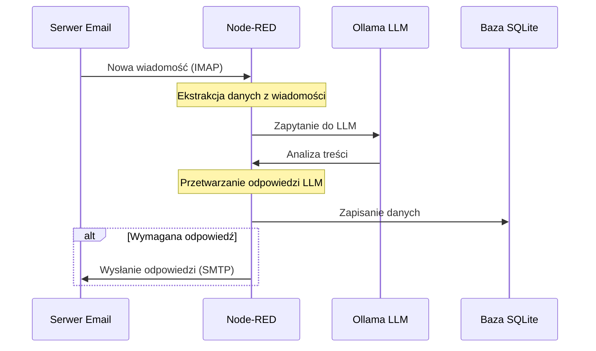
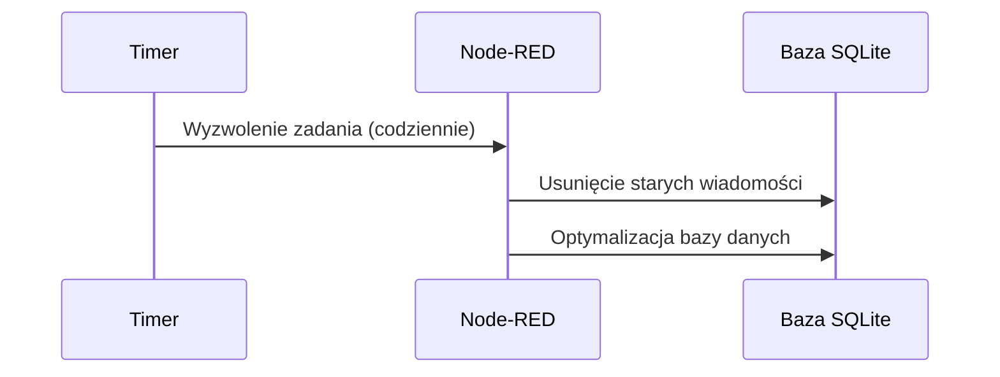

# Implementacja Email-LLM Integration z Node-RED

## Spis treści
1. [Przegląd projektu](#przegląd-projektu)
2. [Architektura systemu](#architektura-systemu)
3. [Przepływy danych](#przepływy-danych)
4. [Instalacja i konfiguracja](#instalacja-i-konfiguracja)
5. [Interfejs Node-RED](#interfejs-node-red)
6. [Węzły i funkcje](#węzły-i-funkcje)
7. [Integracja z Ollama LLM](#integracja-z-ollama-llm)
8. [Obsługa bazy danych SQLite](#obsługa-bazy-danych-sqlite)
9. [API REST](#api-rest)
10. [Rozszerzanie systemu](#rozszerzanie-systemu)


## Przegląd projektu


Email-LLM Integration to system, który integruje skrzynkę pocztową z lokalnym modelem LLM (Large Language Model) Ollama do automatycznego przetwarzania wiadomości email. System monitoruje skrzynkę odbiorczą, analizuje treść wiadomości za pomocą modelu LLM i generuje odpowiednie odpowiedzi. Wszystkie wiadomości i analizy są przechowywane w lokalnej bazie danych SQLite.


- Wizualne programowanie zamiast typowych plików z kodem
- Zmiany w czasie rzeczywistym bez rekompilacji
- Logika biznesowa w małych funkcjach JavaScript bezpośrednio w interfejsie
- Kompleksowe rozwiązanie w jednym kontenerze Node-RED
- Brak potrzeby budowania złożonych klas
- Przejrzysty diagram przepływu danych
- Łatwiejsze debugowanie i monitorowanie

### Główne funkcje:
- Monitorowanie skrzynki odbiorczej email za pomocą protokołu IMAP
- Analiza treści wiadomości za pomocą lokalnego modelu LLM (Ollama)
- Automatyczne generowanie odpowiedzi na podstawie analizy
- Przechowywanie przetworzonych wiadomości w bazie danych SQLite
- Interfejs API REST do zarządzania systemem
- Cykliczne zadania konserwacyjne (czyszczenie starych wiadomości, optymalizacja bazy danych)

### Struktura projektu:

```
email-llm-node-red/
├── docker-compose.yml        # Definicja kontenerów
├── .env                      # Zmienne środowiskowe
├── scripts/                  # Skrypty zarządzające
│   ├── install.sh            # Instalacja
│   ├── start.sh              # Uruchamianie
│   └── stop.sh               # Zatrzymywanie
├── data/                     # Dane aplikacji
│   ├── node-red/             # Konfiguracja Node-RED
│   │   ├── flows.json        # Definicja przepływów
│   │   ├── settings.js       # Ustawienia
│   │   └── lib/              # Biblioteki pomocnicze
│   └── sqlite/               # Baza danych
└── documentation.md          # Pełna dokumentacja
```

### Przepływ danych w Node-RED:

1. **Odbieranie emaili** (węzeł email-in) → 
2. **Ekstrakcja danych** (węzeł function) → 
3. **Analiza przez LLM** (węzeł http-request do Ollama) → 
4. **Przetworzenie odpowiedzi** (węzeł function) → 
5. **Zapis do bazy danych** (węzeł sqlite) → 
6. **Sprawdzenie czy potrzebna odpowiedź** (węzeł switch) → 
7. **Generowanie odpowiedzi** (węzeł function) → 
8. **Wysłanie odpowiedzi** (węzeł email)

### Logika w funkcjach JavaScript:

Porównanie ilości kodu:

| Rozwiązanie | Ilość kodu | Pliki |
|-------------|------------|-------|
| Apache Camel + Groovy | ~500-600 linii | ~10 plików .groovy + konfiguracja |
| Node-RED | ~50-70 linii | 1 plik flows.json + kilka linii JS w węzłach function |

Cała logika biznesowa zawarta jest w prostych funkcjach JavaScript, np:


```javascript
// Przetwarzanie odpowiedzi LLM
let analysis;
try {
    // Próba parsowania JSON z odpowiedzi LLM
    const jsonMatch = /\{[\s\S]*\}/g.exec(msg.payload.response);
    if (jsonMatch) {
        analysis = JSON.parse(jsonMatch[0]);
    } else {
        throw new Error("Nie znaleziono JSON w odpowiedzi");
    }
} catch (e) {
    // Użyj heurystyki jeśli nie udało się sparsować JSON
    analysis = {
        keyTopics: [],
        priority: "medium",
        requiresResponse: false,
        actionRequired: false,
        summary: msg.payload.response.substring(0, 200)
    };
    // Prosta heurystyka dla parametrów
    // ...
}
```

### Jak uruchomić:

```bash
# Instalacja
chmod +x scripts/install.sh
./scripts/install.sh

# Uruchomienie
./scripts/start.sh

# Zatrzymanie
./scripts/stop.sh
```

## Architektura systemu

### Diagram architektury

```
+----------------+       +----------------+       +----------------+
|                |       |                |       |                |
|  Serwer Email  |<----->|    Node-RED    |<----->|  Ollama LLM    |
|                |       |                |       |                |
+----------------+       +-------+--------+       +----------------+
                                 |
                                 |
                                 v
                         +-------+--------+       +----------------+
                         |                |       |                |
                         |  Baza SQLite   |<----->|    Adminer     |
                         |                |       |                |
                         +----------------+       +----------------+
```

### Komponenty:
1. **Node-RED**: Główny komponent integracyjny, odpowiedzialny za przepływ danych i logikę biznesową
2. **Serwer Email**: IMAP/SMTP do odbierania i wysyłania wiadomości (MailHog w środowisku deweloperskim)
3. **Ollama LLM**: Lokalny model językowy do analizy treści
4. **Baza SQLite**: Przechowywanie przetworzonych wiadomości i ich analiz
5. **Adminer**: Interfejs administracyjny do zarządzania bazą danych

## Przepływy danych

### Główny przepływ przetwarzania emaili



### Przepływ zadań konserwacyjnych



## Instalacja i konfiguracja

### Wymagania systemowe
- Docker i Docker Compose
- Minimum 4GB RAM dla kontenera Ollama
- Dostęp do serwera IMAP/SMTP

### Instalacja
1. Przygotuj strukturę projektu:
   ```bash
   # Klonuj repozytorium lub użyj skryptu instalacyjnego
   chmod +x scripts/install.sh
   ./scripts/install.sh
   ```

2. Dostosuj plik `.env` do swoich potrzeb:
   ```
   # Email
   EMAIL_HOST=imap.example.com
   EMAIL_PORT=993
   EMAIL_USER=your@email.com
   EMAIL_PASSWORD=your_password
   ...
   
   # Ollama
   OLLAMA_MODEL=mistral
   ...
   ```

3. Uruchom system:
   ```bash
   ./scripts/start.sh
   ```

### Dostęp do komponentów
Po uruchomieniu, dostępne są następujące interfejsy:
- Node-RED: http://localhost:1880
- Panel mailowy (MailHog): http://localhost:8025
- Panel bazy danych (Adminer): http://localhost:8081

## Interfejs Node-RED

Node-RED zapewnia wizualny interfejs do tworzenia i edycji przepływów integracyjnych. Główny interfejs składa się z:

1. **Palety węzłów** - lewa kolumna zawierająca dostępne węzły
2. **Obszar edycji przepływów** - centralna część do tworzenia przepływów
3. **Panel informacji/debugowania** - prawa kolumna do konfiguracji węzłów i debugowania

### Logowanie do interfejsu
- Adres: http://localhost:1880
- Login domyślny: admin
- Hasło domyślne: password (można zmienić w pliku `.env`)

### Główne zakładki
- **Flow** - główny przepływ przetwarzania emaili
- **Configuration Nodes** - konfiguracja globalnych węzłów (np. połączenia z bazą danych)
- **Menu hamburger** - dostęp do importu/eksportu przepływów, zarządzania paletami, etc.

## Węzły i funkcje

Projekt wykorzystuje następujące główne węzły Node-RED:

### Monitorowanie emaili
- **e-mail in** - odbiera wiadomości z serwera IMAP
- Konfiguracja: server, port, credentials, folder, etc.

### Logika przetwarzania
- **function** - węzły JavaScript do implementacji logiki biznesowej
  - `Ekstrahuj dane z emaila` - ekstrakcja danych z wiadomości
  - `Przetwórz odpowiedź LLM` - parsowanie i przetwarzanie odpowiedzi z modelu
  - `Przygotuj odpowiedź` - generowanie treści odpowiedzi

### Integracja z zewnętrznymi systemami
- **http request** - komunikacja z API Ollama
- **sqlite** - operacje na bazie danych SQLite
- **e-mail** - wysyłanie wiadomości email

### Sterowanie przepływem
- **switch** - podejmowanie decyzji na podstawie warunków
- **cron-plus** - planowanie cyklicznych zadań

### API REST
- **http in** - endpointy przychodzące API
- **http response** - odpowiedzi API

## Integracja z Ollama LLM

### Konfiguracja modelu
1. Model jest pobierany automatycznie podczas uruchamiania (`start.sh`)
2. Domyślnie używany jest model `mistral`, można to zmienić w pliku `.env`

### Komunikacja z API Ollama
Węzeł **http request** komunikuje się z API Ollama. Główny endpoint: `/api/generate`

Przykładowe zapytanie do Ollama:
```javascript
// Z węzła function: Przygotowanie zapytania dla Ollama
msg.payload = {
    model: "mistral",
    prompt: `Przeanalizuj poniższą wiadomość email:

Od: ${email.sender}
Do: ${email.recipients}
Temat: ${email.subject}
Treść:
${email.bodyText}

Odpowiedz w formacie JSON z następującymi polami:
{
  "keyTopics": ["temat1", "temat2"],
  "priority": "high/medium/low",
  "requiresResponse": true/false,
  "actionRequired": true/false,
  "summary": "krótkie podsumowanie"
}`,
    stream: false
};
```

### Przetwarzanie odpowiedzi
Węzeł `Przetwórz odpowiedź LLM` analizuje odpowiedź z modelu:
```javascript
// Parsowanie odpowiedzi LLM
let analysis;
try {
    // Próba znalezienia i parsowania JSON
    const jsonMatch = /\{[\s\S]*\}/g.exec(msg.payload.response);
    if (jsonMatch) {
        analysis = JSON.parse(jsonMatch[0]);
    } else {
        throw new Error("Nie znaleziono JSON w odpowiedzi");
    }
} catch (e) {
    // Użyj heurystyki jeśli nie udało się sparsować JSON
    analysis = {
        keyTopics: [],
        priority: "medium",
        requiresResponse: false,
        actionRequired: false,
        summary: msg.payload.response.substring(0, 200)
    };
    
    // Prosta heurystyka dla parametrów
    const responseText = msg.payload.response.toLowerCase();
    
    if (responseText.includes("wysoki priorytet")) {
        analysis.priority = "high";
    }
    
    if (responseText.includes("wymaga odpowiedzi")) {
        analysis.requiresResponse = true;
    }
}
```

## Obsługa bazy danych SQLite

### Struktura bazy danych
Baza danych SQLite zawiera dwie główne tabele:

1. **processed_emails** - przetworzone wiadomości email
   ```sql
   CREATE TABLE processed_emails (
       id INTEGER PRIMARY KEY AUTOINCREMENT,
       message_id TEXT UNIQUE,
       subject TEXT,
       sender TEXT,
       recipients TEXT,
       received_date TEXT,
       processed_date TEXT,
       body_text TEXT,
       body_html TEXT,
       status TEXT,
       llm_analysis TEXT,
       metadata TEXT
   );
   ```

2. **email_attachments** - załączniki wiadomości
   ```sql
   CREATE TABLE email_attachments (
       id INTEGER PRIMARY KEY AUTOINCREMENT,
       email_id INTEGER,
       filename TEXT,
       content_type TEXT,
       size INTEGER,
       content BLOB,
       FOREIGN KEY (email_id) REFERENCES processed_emails(id) ON DELETE CASCADE
   );
   ```

### Operacje bazodanowe
Węzły **sqlite** służą do wykonywania operacji na bazie danych:

1. Zapisywanie wiadomości:
   ```sql
   INSERT INTO processed_emails 
   (message_id, subject, sender, recipients, received_date, processed_date, body_text, body_html, status, llm_analysis) 
   VALUES (?, ?, ?, ?, ?, ?, ?, ?, ?, ?)
   ```

2. Pobieranie wiadomości:
   ```sql
   SELECT * FROM processed_emails ORDER BY received_date DESC LIMIT 100
   ```

3. Usuwanie starych wiadomości:
   ```sql
   DELETE FROM processed_emails 
   WHERE received_date < datetime('now', '-30 days') 
   AND status IN ('processed', 'failed')
   ```

4. Optymalizacja bazy danych:
   ```sql
   VACUUM; PRAGMA optimize;
   ```

### Dostęp do bazy przez Adminer
- Adres: http://localhost:8081
- System: SQLite 3
- Server: `/data/emails.db`
- Bez hasła

## API REST

System udostępnia następujące endpointy API:

### Health check
- **GET /api/health** - sprawdzenie stanu aplikacji
  ```json
  {
    "status": "UP",
    "time": "2025-05-17T12:34:56.789Z",
    "components": {
      "sqlite": "UP",
      "ollama": "UP"
    }
  }
  ```

### Zarządzanie emailami
- **GET /api/emails** - lista przetworzonych wiadomości
  ```json
  {
    "emails": [
      {
        "id": 1,
        "message_id": "abc123",
        "subject": "Test Email",
        "sender": "test@example.com",
        "status": "processed",
        "received_date": "2025-05-17T10:00:00.000Z"
      }
    ],
    "total": 1,
    "page": 1,
    "status": "success"
  }
  ```

- **GET /api/emails/:id** - szczegóły wiadomości
  ```json
  {
    "email": {
      "id": 1,
      "message_id": "abc123",
      "subject": "Test Email",
      "sender": "test@example.com",
      "recipients": "recipient@example.com",
      "received_date": "2025-05-17T10:00:00.000Z",
      "processed_date": "2025-05-17T10:01:00.000Z",
      "body_text": "To jest testowa wiadomość",
      "body_html": "<p>To jest testowa wiadomość</p>",
      "status": "processed",
      "llm_analysis": "{\"keyTopics\":[\"test\"],\"priority\":\"medium\",\"requiresResponse\":false}"
    },
    "status": "success"
  }
  ```

### Bezpośrednia analiza LLM
- **POST /api/llm/direct-analyze** - analiza tekstu za pomocą LLM
  ```json
  // Żądanie
  {
    "text": "Dzień dobry, potrzebuję pilnej pomocy z zamówieniem #12345.",
    "context": "Klient wielokrotnie kontaktował się w tej sprawie."
  }
  
  // Odpowiedź
  {
    "result": {
      "keyTopics": ["zamówienie", "pomoc", "pilne"],
      "priority": "high",
      "requiresResponse": true,
      "actionRequired": true,
      "summary": "Klient potrzebuje pilnej pomocy z zamówieniem #12345."
    },
    "model": "mistral",
    "processing_time": 0.573,
    "timestamp": "2025-05-17T12:34:56.789Z"
  }
  ```

## Rozszerzanie systemu

### Dodawanie nowych funkcji
System można łatwo rozszerzyć za pomocą interfejsu Node-RED:

1. **Nowe typy analizy** - modyfikacja promptu i przetwarzania odpowiedzi LLM
2. **Dodatkowe źródła danych** - dodanie innych węzłów wejściowych (np. RSS, API, itd.)
3. **Integracja z innymi systemami** - dodanie węzłów wyjściowych (np. Slack, webhook, itd.)

### Modyfikacja przepływów
1. Zaloguj się do interfejsu Node-RED (http://localhost:1880)
2. Edytuj istniejące przepływy lub utwórz nowe
3. Kliknij "Deploy" aby zastosować zmiany

### Dodawanie własnych węzłów JavaScript
Węzły **function** pozwalają na implementację własnej logiki w JavaScript:

```javascript
// Przykładowy węzeł function do analizy sentymentu
const text = msg.payload.bodyText;
const negativeWords = ["problem", "błąd", "awaria", "zły", "nie działa"];
const positiveWords = ["dziękuję", "świetnie", "dobrze", "pochwała"];

let sentiment = "neutral";
let negCount = 0;
let posCount = 0;

negativeWords.forEach(word => {
    if (text.toLowerCase().includes(word)) negCount++;
});

positiveWords.forEach(word => {
    if (text.toLowerCase().includes(word)) posCount++;
});

if (negCount > posCount) sentiment = "negative";
if (posCount > negCount) sentiment = "positive";

msg.sentiment = sentiment;
return msg;
```

### Dostosowanie modelu LLM
1. Zmień model w pliku `.env`: `OLLAMA_MODEL=llama2`
2. Zrestartuj aplikację: `./scripts/restart.sh`
3. Dostosuj prompt i przetwarzanie odpowiedzi w węzłach **function**

### Integracja z zewnętrznymi API
Node-RED pozwala na łatwą integrację z zewnętrznymi systemami poprzez węzły **http request**:

```javascript
// Przykład integracji z zewnętrznym systemem CRM
msg.url = "https://api.crm.example.com/customers/" + msg.email.sender;
msg.headers = {
    "Authorization": "Bearer " + flow.get("crmApiKey"),
    "Content-Type": "application/json"
};
return msg;
```

---

